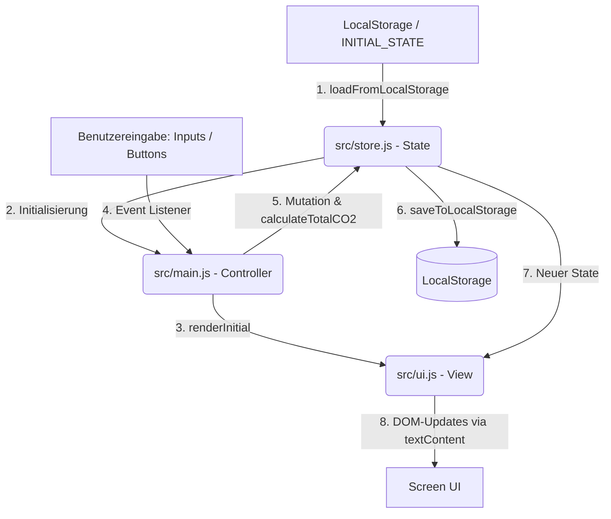

# Implementation Plan - Integration von Google Stitch & Google AI Studio

Dieser Implementierungsplan beschreibt die Integration des funktionalen CO2-Rechner-Kerns (aus Google AI Studio) mit der visuellen Spezifikation von `CARBON_OS v1.0` (aus Google Stitch), unter 100%iger Einhaltung der Vorgaben aus [AGENTS.md](file:///Users/philipp.paulsen/antigravity/CO2-Rechner-Kernlogik/Agents.md).

---

## 1. Dateistruktur-Tabelle

Die Anwendung wird von der aktuellen React/Vite/TypeScript-Struktur auf ein reines Vanilla-HTML5/CSS3/ES6-Modul-System migriert. Dies eliminiert jegliche Build-Tools und erfüllt die strengen technischen Constraints aus [AGENTS.md](file:///Users/philipp.paulsen/antigravity/CO2-Rechner-Kernlogik/Agents.md).

| Status | Dateipfad | Beschreibung |
| :--- | :--- | :--- |
| **[MODIFY]** | [index.html](file:///Users/philipp.paulsen/antigravity/CO2-Rechner-Kernlogik/index.html) | Haupt-Einstiegspunkt. Integriert das HTML5-Skelett aus `CARBON_OS v1.0`, lädt Tailwind CSS via CDN sowie Google Fonts und bindet `src/main.js` als ES6-Modul ein. |
| **[NEW]** | [styles.css](file:///Users/philipp.paulsen/antigravity/CO2-Rechner-Kernlogik/styles.css) | Enthält alle benutzerdefinierten CSS3-Stile (Ambient-Grid-Pulse, Scanline-Animationen, Shimmer-Effekte, Custom Scrollbar und Breathing Glow für das Ergebnispanel). |
| **[NEW]** | [src/main.js](file:///Users/philipp.paulsen/antigravity/CO2-Rechner-Kernlogik/src/main.js) | Orchestriert den Anwendungslebenszyklus. Initialisiert den Store, triggert das Rendering und bindet Event-Listener über die UI-Schicht an. |
| **[MODIFY]** | [src/store.js](file:///Users/philipp.paulsen/antigravity/CO2-Rechner-Kernlogik/src/store.js) | Reines State-Management. Beinhaltet `INITIAL_STATE`, `EMISSION_FACTORS`, Berechnungsformeln und LocalStorage-Schnittstellen. Keine UI- oder DOM-Abhängigkeiten! |
| **[NEW]** | [src/ui.js](file:///Users/philipp.paulsen/antigravity/CO2-Rechner-Kernlogik/src/ui.js) | Kapselt die gesamte DOM-Manipulation und Darstellung. Aktualisiert Anzeigewerte live, schaltet Tabs um, zeigt Overlays und verhindert XSS durch strikte Vermeidung von `innerHTML`. |
| **[NEW]** | [src/api.js](file:///Users/philipp.paulsen/antigravity/CO2-Rechner-Kernlogik/src/api.js) | Kapselt asynchrone Schnittstellen. Lädt den Quellcode von `store.js` via fetch dynamically, um ihn im Source-Tab anzuzeigen. |
| **[DELETE]** | `src/App.tsx` | Gelöscht (Replaced by Vanilla HTML/CSS/JS) |
| **[DELETE]** | `src/main.tsx` | Gelöscht (Replaced by Vanilla HTML/CSS/JS) |
| **[DELETE]** | `src/index.css` | Gelöscht (Replaced by Vanilla HTML/CSS/JS) |
| **[DELETE]** | `vite.config.ts` | Gelöscht (Replaced by Vanilla HTML/CSS/JS) |
| **[DELETE]** | `tsconfig.json` | Gelöscht (Replaced by Vanilla HTML/CSS/JS) |

---

## 2. Datenflüsse (Zustandsverwaltung)

Um eine strikte Zustandstrennung (*Separation of Concerns*) zu wahren, erfolgt der Datenfluss in einem unidirektionalen Zyklus:



### Zustand-Updates
- Jede Interaktion (Eingabe in `input-car-km`, `input-public-km`, `input-meat-days`, `input-vegan-days`, `input-electricity-kwh`) oder Buttons (`btn-manual-save`, `btn-reset`) sendet Events an `src/main.js`.
- `main.js` mutiert den State im `store.js` und führt `calculateTotalCO2(state)` aus.
- Der aktualisierte State wird im LocalStorage persistent gespeichert und sofort an `src/ui.js` zur visuellen Aktualisierung übergeben.

---

## 3. UI-Komponenten

Die UI übernimmt das hochentwickelte, immersive Dark-Mode-Design `CARBON_OS v1.0` aus der visuellen Spezifikation.

- **Status & Navigation**:
  - Top-AppBar mit dem Status `ES6_MODULE_SYNCED` und Sensoren-Symbol.
  - BottomNavBar für das Umschalten zwischen **COMPUTE** (`tab-calculator`) und **SOURCE** (`tab-code`).
- **Eingabe-Module**:
  - **Transport**: Karten für Car Travel (`input-car-km`) und Public Transport (`input-public-km`) mit Live-Glow bei Fokus.
  - **Dietary**: Karten für Meat-Rich (`input-meat-days`) und Vegan (`input-vegan-days`).
  - **Energy**: Karte für Electricity Monthly (`input-electricity-kwh`) mit integriertem dekorativen Live-Meter.
- **Ergebnis-Panel (breathing result-glow)**:
  - Zeigt das berechnete Gesamt-CO2 live in großer, eleganter Schrift (Garamond-Stil).
  - Zeigt den Fußabdruck-Vergleich aufgegliedert nach `TRAFFIC` und `LIVING`.
  - Buttons für `SAVE_STATE` (`btn-manual-save`) und `RESET` (`btn-reset`).
- **Micro-Interaktionen & Overlays**:
  - Ein ansprechendes `#save-overlay` mit Shimmer-Effekt bestätigt die erfolgreiche Zustandsspeicherung.
  - Einbindung flüssiger Übergangs- und Pulse-Animationen direkt über `styles.css`.

---

## 4. CORS / Pfad-Risiken

Bei der Entwicklung mit nativen ES6-Modulen im Browser treten bei lokaler Ausführung über das `file://`-Protokoll strikte CORS-Sicherheitsbeschränkungen auf. 

> [!IMPORTANT]
> **Pfad- & CORS-Risiko-Vermeidung:**
> 1. Alle Imports in den Modul-Dateien müssen relative Dateipfade inklusive der expliziten `.js`-Erweiterung verwenden (z. B. `import { store } from "./store.js"`).
> 2. Die Anwendung darf lokal **nicht** direkt per Doppelklick auf die HTML-Datei geöffnet werden. Stattdessen wird ein lokaler Webserver betrieben (z. B. über Pythons integrierten Server).

---

## 5. Teststrategie

Nach der Synthese wird ein strukturierter Verifikationsprozess durchgeführt:

### Automatisches Runtime-Testing (ReAct)
1. Starten des lokalen Servers im Projektverzeichnis über:
   ```bash
   python -m http.server 8080
   ```
2. Systematischer Aufruf der Seite im Webbrowser (`http://localhost:8080`).
3. Analyse der JavaScript-Konsole auf CORS-Verstöße, Pfadfehler oder Syntax-Inkompatibilitäten und autonome Behebung.

### Funktionale Validierungsschritte (Manuell & Programmatisch)
- **Eingabevalidierung**: Überprüfung, ob negative Werte abgefangen werden (Mindestwert `0`).
- **Berechnungspräzision**: Verifikation der CO2-Ergebnisberechnung anhand vordefinierter Testdaten (z. B. 42km Auto & 128km ÖPNV & 2 Tage Fleisch & 5 Tage Vegan & 214 kWh Strom = 12.4 kg CO2e).
- **Persistierung**: Validierung des LocalStorage-Speichers und Wiederherstellung nach einem Seiten-Reload.
- **XSS-Sicherheit**: Verifikation, dass sämtliche dynamischen Werte ausschließlich über sichere Methoden (`textContent` / `value`) in das DOM geschrieben werden.

---

## User Review Required

> [!NOTE]
> Die visuelle Spezifikation verwendet standardmäßig Tailwind CSS via CDN. Dies ermöglicht eine perfekte 1:1-Wiedergabe des Google Stitch-Designs im nativen HTML-Format, ohne dass Build-Tools wie Vite, npm-Verzeichnisse oder Node-Compiler im produktiven Betrieb benötigt werden. Dies entspricht vollkommen dem Geist der `AGENTS.md`-Regeln.

Bitte bestätige diesen Plan mit **"Plan bestätigt"**, um die Synthese der Vanilla-Struktur zu starten!
